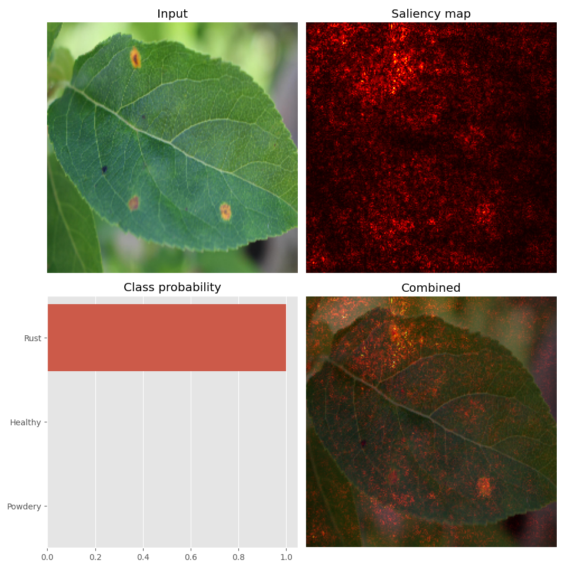

## Computer vision

          
This repository contains some base functions / classes that I use on a daily basis for my work.
We can find base code that I wrote for:
- Classification problems (ResNet18)
- Model interpretability to understand the predicted class (Saliency Map)
- Detection problems (Faster RCNN with MobileNet Backbone)
- Classic image preprocessing
- Training and Inference code

I am paying attention to write the code with not too high level library so that I have full flexibility 
either to customize on specific use cases or to translate in another language (i.e C++) when it comes to embedded AI use cases.

#### Example output from a plant disease classifier (ResNet 18)
