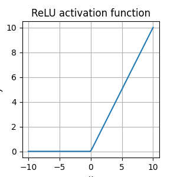

# Convolutional Neural Networks (CNN's)

The type of deep neural network that is most powerful in image processing tasks, such as sorting images into groups, is called a Convolutional Neural Network (CNN). CNN's consist of layers that process visual information. A CNN first takes in an input image and then passes it through these layers. There are a few different types of layers, and we'll start by learning about the most commonly used layers: convolutional, pooling, and fully-connected layers.
  
## Convolutional Layer
The conv layer can be thought as a __feature extractor__
- It learns to find spatial feature in an input image  
- It is made of a set of filters called __convolutional kernels__ that are stacked together
- Values inside the kernel are called __weights__
- Each kernel extracts a specific kind of feature, ex. edges (for a high-pass kernel)
- The output of a given convolutional layer is a set of feature maps (also called activation maps), which are filtered versions of an original input image
- Multiple kernels will produce multiple filtered output images of about the same size as the input image

## Activation Function
Image pixels range from 0-255, but in practice the input image to a CNN have pixels ranging from 0-1 because __neural networks__ works better with scaled values.
The process of scaling 0-255 to 0-1 is called __Normalization__.  
Then the normalized image pass through a CNN, after the __convolution operation__ values of pixels falls in a different range, we may even have negative values.  
  
To account for this change in pixel value, after the convolution, the CNN applies an __activation function__ that transform each pixel value.  
### ReLu (Rectified Linear Unit)
If the pixel is negative, it will be maps as 0. If >= 0 it will remain unchanged.

  
The activation function also introduce non-linearity into a model, so the CNN will be able to find nonlinear thresholds/boundaries that classify training data in the case of image classification.

## Max pooling Layer
After a convolutional layer comes a pooling layer; the most common type of pooling layer is a max-pooling layer. The max-pooling operation breaks an image into smaller patches, often 2x2 pixel areas. A max-pooling layer is defined by the patch size, 2x2, and a stride. The patch can be thought of as a 2x2 window that the max-pooling layer looks at to select a maximum pixel value. It then moves this window by some stride across and down the image. For a patch of size 2x2 and a stride of 2, this window will perfectly cover the image. A smaller stride would see some overlap in patches and a larger stride would miss some pixels entirely. So, we usually see a patch size and a stride size that are the same.  

The process of max-pooling is used for few reasons:
- __Dimensionality reduction__; increase the depth but decrease the height and width of the image
- Makes a network resistant to small pixel value changes in an input image
- By reducing the width and height of image data as it moves forward through the CNN, the max-pooling layer __mimics an increase in the field of view__ for later layers. This allows later convolutional layers to detect features in a larger region of the input image.  
For example a 3x3 kernel applied to an image will see a 3x3 pixel area at once. But on a pooled version, the same kernel will be applied to a larger region since the image h, w has been reduced.

## Fully-connected Layer
At the end of a convolutional neural network, is a fully-connected layer (sometimes more than one). Fully-connected means that every output that’s produced at the end of the last pooling layer is an input to each node in this fully-connected layer. For example, for a final pooling layer that produces a stack of outputs that are 20 pixels in height and width and 10 pixels in depth (the number of filtered images), the fully-connected layer will see 20x20x10 = 4000 inputs. The role of the last fully-connected layer is to produce a list of class scores.  
So, the last fully-connected layer will have as many nodes as there are classes.

## Softmax (probability of classes)
The very last layer in image classification can be a softmax function.
The softmax function, can take any vector of values as input and returns a vector of the same length whose values are all in the range (0, 1) and, together, these values will add up to 1. This function is often seen in classification models that have to turn a feature vector into a probability distribution.

## Extra Layers for performance: Dropout / Batch normalization to avoid overfitting
Dropout layers essentially turn off certain nodes in a layer with some probability, p. This ensures that all nodes get an equal chance to try and classify different images during training, and it reduces the likelihood that only a few, heavily-weighted nodes will dominate the process.
Dropout often happen near end of networks, between fully-connected layers for example.  
Batch norm usually applied after early layers in the network, say after a set of conv/pool/activation steps since this normalization step is fairly quick and reduces the amount by which hidden weight values shift around.

# Some feature Visualization Techniques
## Occlusion Experiments
Occlusion means to block out or mask part of an image or object. For example, if you are looking at a person but their face is behind a book; this person's face is hidden (occluded). Occlusion can be used in feature visualization by blocking out selective parts of an image and seeing how a network responds.  
  
The process for an occlusion experiment is as follows:
- Mask part of an image before feeding it into a trained CNN,
- Draw a heatmap of class scores for each masked image,
- Slide the masked area to a different spot and repeat steps 1 and 2.  
  
The result should be a heatmap that shows the predicted class of an image as a function of which part of an image was occluded. __The reasoning is that if the class score for a partially occluded image is different than the true class, then the occluded area was likely very important!__

## Saliency Maps
Salience can be thought of as the importance of something, and for a given image, a saliency map asks: Which pixels are most important in classifying this image?  

Saliency maps aim to show these important pictures by computing the gradient of the class score with respect to the image pixels. A gradient is a measure of change, and so, the gradient of the class score with respect to the image pixels is a measure of how much a class score for an image changes if a pixel changes a little bit.
__So it identify the most important pixel that allow classifying a certain image in a certain class__

## Guided Backpropagation
Similar to the process for constructing a saliency map, you can compute the gradients for mid level neurons in a network with respect to the input pixels. Guided backpropagation looks at each pixel in an input image, and asks: if we change it's pixel value slightly, how will the output of a particular neuron or layer in the network change. If the expected output change a lot, then the pixel that experienced a change, is important to that particular layer.
  
This is very similar to the backpropagation steps for measuring the error between an input and output and propagating it back through a network. Guided backpropagation tells us exactly which parts of the image patches, that we’ve looked at, activate a specific neuron/layer.

