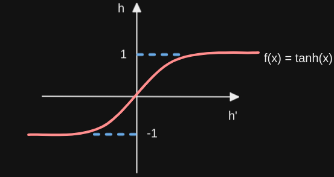

## Recurrent Neural Networks (RNN's)

### Preliminaries - Feed-Forward Neural Network

- n inputs x
- 3 neurons in a single hidden layer h
- 2 outputs y
- W1 as set of weights from x to h
- W2 as set of weights from h to y
  
  

Since there is only one hidden layer, there will be only 2 steps in the feedforward cycle:
- __Step 1__: Finding `h_bar` from input `x_bar` and set of weights `W1`
- __Step 2__: Finding the output `y_bar` from the calculated `h_bar` and the set of weights `W2`
  
### __Step 1__: Finding `h_bar`  
When we have more than one neuron in the hidden layer (3 here), h_bar is a vector.

We denote `W_ij` the weight that connect input `i` to the hidden neuron `j`. So the weight that connect input `2` to the 
hidden neuron `3` is denoted as `W_23`.  
  
The input vector `x_bar = [x1, x2, x3, ..., xn]`  
is multiplied by the weight matrix `W1 = [W_11, W_12, W_13; W_21, W_22, W_23; W_31, W_32, W_33; ...; W_n1, W_n2, W_n3 ]`  
to produce `h_bar' = [h'1, h'2, h'3]`  

<h3>
h_bar' = x_bar ⋅ W1 
</h3>  

To make sure the values of `h_bar` do not explode or increase too much in size, we use an __activation function__ `Φ`.  

<h3>
h_bar = Φ(h_bar') 
</h3>   

### Example of __activation functions__
### The __hyperbolic tangent__: to ensure the output is between 1 and -1  

   

***  
### The __sigmoid__: to ensure the output is between 1 and 0  

   
#### Disadvantage
Let's denote the sigmoid function `f(x) = 1 / 1+e^-x`. If we derive the function we obtain `f'(x) = f(x)(1-f(x))`.  
The sigmoid here forces the model to "lose" information from the data. 
If we plot the derivative and think about the possible max value of the derivative of the sigmoid, the output is 
squeezed by at least one quarter at each layer during __backpropagation__, this can become a huge loss of information in
deeper neural network.   

Sigmoid being between 0 and 1, we can see that the max value of the derivative is 0.25.
  
So we avoid using the Sigmoid in DNN as activation functions for hidden units.  

***  
### The __Rectified Linear unit (ReLu)__: to ensure negative values to be 0 and positive values remain the same  

   
#### Advantage
Faster during training, good for deep neural network since the max of the derivative is 1, so no squeezing effect of the error 
during __backpropagation__.
#### Disadvantage  
If the learning rate is too high, ReLu units becomes fragile during the training phase and can die.
large gradient flowing through a ReLU neuron could cause the weights to update in such a way that the neuron will never 
activate on any datapoint again. If this happens, then the gradient flowing through the unit will forever be zero from 
that point on (by Andrej Karpathy [here](https://cs231n.github.io/neural-networks-1/#nn))
  

### In short
They all allow the network to represent nonlinear relationships between its inputs and outputs (crucial because most 
real word data is nonlinear).
But using them is tricky since they contribute to the __vanishing gradient problem__.  
#### Which one should I pick?
TLDR: Use the ReLU non-linearity, be careful with your learning rates and possibly monitor the fraction of “dead” units 
in a network. If this concerns you, give Leaky ReLU or Maxout a try. Never use sigmoid. Try tanh, but expect it to work 
worse than ReLU/Maxout.  

### __Step 2__: Finding `y_bar`  

Mathematically the idea is the same as for __finding h_bar in step 1__  
The input vector `h_bar = [h1 h2 h3]`  
is multiplied by the weight matrix `W2 = [W_11 W_12 W_13; W_21 W_22 W_23; W_31 W_32 W_33;]`  
to produce `y_bar' = [y1, y2]`  

<h3>
y_bar = h_bar ⋅ W2 
</h3> 

Once `y_bar` found, adding an __activation function__ is optional. In some problems, we can use the __softmax function__
(ie. multiclass classification).  
The softmax will allow the values to be between 0 and 1 and the sum of the values will be 1 (good for probabilities).

   

